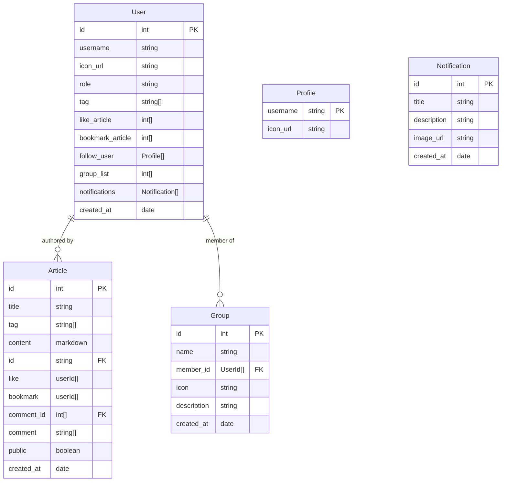

```mermaid
erDiagram
User {
id int PK
username string
icon_url string
role string
tag string[]
like_article int[]
bookmark_article int[]
follow_user Profile[]
group_list int[]
notifications Notification[]
created_at date
}

Article {
id int PK
title string
tag string[]
content markdown
id string FK
like userId[]
bookmark userId[]
comment_id int[] FK
comment string[]
public boolean
created_at date
}

Group{
id int PK
name string
member_id UserId[] FK
icon string
description string
created_at date
}

Profile{
username string PK
icon_url string
}

Notification{
id int PK
title string
description string
image_url string
created_at date
}
User ||--o{ Article : "authored by"

User ||--o{ Group : "member of"
```
