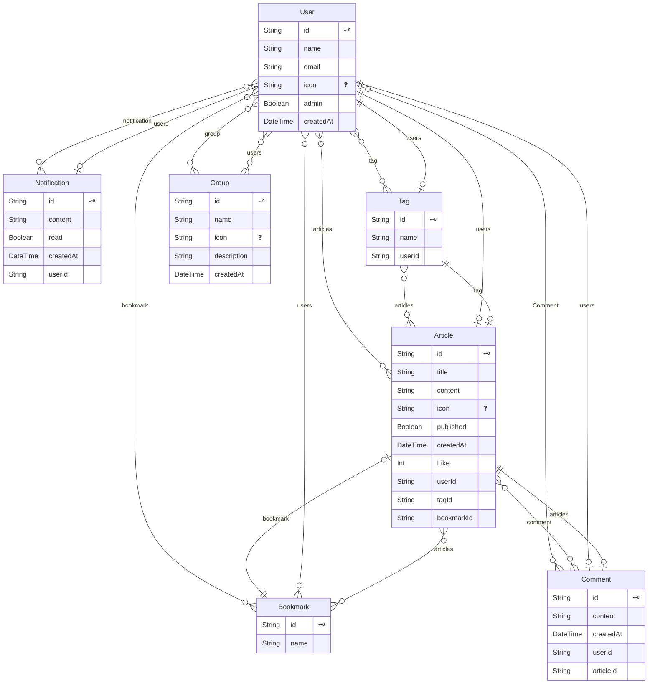

```mermaid
erDiagram

  "User" {
    String id "🗝️"
    String name 
    String email 
    String icon "❓"
    Boolean admin 
    DateTime createdAt 
    }
  

  "Article" {
    String id "🗝️"
    String title 
    String content 
    String icon "❓"
    Boolean published 
    DateTime createdAt 
    Int Like 
    String userId 
    String tagId 
    String bookmarkId 
    }
  

  "Notification" {
    String id "🗝️"
    String content 
    Boolean read 
    DateTime createdAt 
    String userId 
    }
  

  "Tag" {
    String id "🗝️"
    String name 
    String userId 
    }
  

  "Bookmark" {
    String id "🗝️"
    String name 
    }
  

  "Group" {
    String id "🗝️"
    String name 
    String icon "❓"
    String description 
    DateTime createdAt 
    }
  

  "Comment" {
    String id "🗝️"
    String content 
    DateTime createdAt 
    String userId 
    String articleId 
    }
  
    "User" o{--}o "Tag" : "tag"
    "User" o{--}o "Bookmark" : "bookmark"
    "User" o{--}o "Group" : "group"
    "User" o{--}o "Article" : "articles"
    "User" o{--}o "Notification" : "notification"
    "User" o{--}o "Comment" : "Comment"
    "Article" o|--|| "User" : "users"
    "Article" o|--|| "Tag" : "tag"
    "Article" o|--|| "Bookmark" : "bookmark"
    "Article" o{--}o "Comment" : "comment"
    "Notification" o|--|| "User" : "users"
    "Tag" o|--|| "User" : "users"
    "Tag" o{--}o "Article" : "articles"
    "Bookmark" o{--}o "User" : "users"
    "Bookmark" o{--}o "Article" : "articles"
    "Group" o{--}o "User" : "users"
    "Comment" o|--|| "User" : "users"
    "Comment" o|--|| "Article" : "articles"
```
