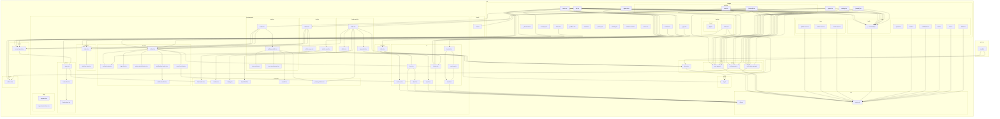

# TypeScript Graph

```bash
tsg --exclude node_modules
```


```mermaid
flowchart
    subgraph src["src"]
        subgraph src/data["/data"]
            src/data/tag.ts["tag.ts"]
        end
        subgraph src/utils["/utils"]
            src/utils/binary.ts["binary.ts"]
            subgraph src/utils/query["/query"]
                src/utils/query/article.query.ts["article.query.ts"]
                src/utils/query/notification.query.ts["notification.query.ts"]
                src/utils/query/user.query.ts["user.query.ts"]
            end
        end
        subgraph src/lib["/lib"]
            src/lib/utils.ts["utils.ts"]
            src/lib/prisma.ts["prisma.ts"]
        end
        subgraph src/components["/components"]
            subgraph src/components/ui["/ui"]
                src/components/ui/toast.tsx["toast.tsx"]
                src/components/ui/use//toast.ts["use-toast.ts"]
                src/components/ui/button.tsx["button.tsx"]
                src/components/ui/input.tsx["input.tsx"]
                src/components/ui/label.tsx["label.tsx"]
                src/components/ui/form.tsx["form.tsx"]
                src/components/ui/textarea.tsx["textarea.tsx"]
                src/components/ui/toaster.tsx["toaster.tsx"]
            end
            subgraph src/components/common["/common"]
                src/components/common/like//button.tsx["like-button.tsx"]
                src/components/common/divider.tsx["divider.tsx"]
                src/components/common/dialog.tsx["dialog.tsx"]
                src/components/common/input//field.tsx["input-field.tsx"]
                src/components/common/modal.tsx["modal.tsx"]
                src/components/common/primary//button.tsx["primary-button.tsx"]
            end
            subgraph src/components/article["/article"]
                src/components/article/article//card.tsx["article-card.tsx"]
                src/components/article/article//page.tsx["article-page.tsx"]
                src/components/article/index.tsx["index.tsx"]
            end
            subgraph src/components/header["/header"]
                src/components/header/profile//button.tsx["profile-button.tsx"]
                src/components/header/logo//title.tsx["logo-title.tsx"]
                src/components/header/make//article//button.tsx["make-article-button.tsx"]
                src/components/header/notification//list.tsx["notification-list.tsx"]
                src/components/header/notification//button.tsx["notification-button.tsx"]
                src/components/header/search//article.tsx["search-article.tsx"]
                src/components/header/index.tsx["index.tsx"]
            end
            subgraph src/components/sidebar["/sidebar"]
                src/components/sidebar/side//bar//item.tsx["side-bar-item.tsx"]
                src/components/sidebar/index.tsx["index.tsx"]
            end
            subgraph src/components/footer["/footer"]
                src/components/footer/footer//item.tsx["footer-item.tsx"]
                src/components/footer/footer//list.tsx["footer-list.tsx"]
                src/components/footer/index.tsx["index.tsx"]
            end
            subgraph src/components/contact["/contact"]
                src/components/contact/index.tsx["index.tsx"]
            end
            subgraph src/components/make//article["/make-article"]
                src/components/make//article/editor.tsx["editor.tsx"]
                src/components/make//article/tag//select.tsx["tag-select.tsx"]
                src/components/make//article/index.tsx["index.tsx"]
            end
            subgraph src/components/setting["/setting"]
                src/components/setting/icon//editor.tsx["icon-editor.tsx"]
                src/components/setting/user//email//name.tsx["user-email-name.tsx"]
                src/components/setting/setting//profile.tsx["setting-profile.tsx"]
                src/components/setting/index.tsx["index.tsx"]
            end
            subgraph src/components/tag["/tag"]
                src/components/tag/tag//item.tsx["tag-item.tsx"]
                src/components/tag/tag//selected//item.tsx["tag-selected-item.tsx"]
            end
        end
        subgraph src/mock["/mock"]
            src/mock/user.ts["user.ts"]
        end
        subgraph src/pages["/pages"]
            src/pages///userId//.tsx["[userId].tsx"]
            src/pages///app.tsx["_app.tsx"]
            src/pages///docment.tsx["_docment.tsx"]
            src/pages/about.tsx["about.tsx"]
            src/pages/company.tsx["company.tsx"]
            src/pages/contact.tsx["contact.tsx"]
            src/pages/fav.tsx["fav.tsx"]
            src/pages/guidline.tsx["guidline.tsx"]
            src/pages/index.tsx["index.tsx"]
            src/pages/news.tsx["news.tsx"]
            src/pages/privacy.tsx["privacy.tsx"]
            src/pages/ranking.tsx["ranking.tsx"]
            src/pages/release//note.tsx["release-note.tsx"]
            src/pages/setting.tsx["setting.tsx"]
            src/pages/signin.tsx["signin.tsx"]
            src/pages/signout.tsx["signout.tsx"]
            src/pages/terms.tsx["terms.tsx"]
            subgraph src/pages/api["/api"]
                src/pages/api/article.ts["article.ts"]
                src/pages/api/like.ts["like.ts"]
                src/pages/api/link.ts["link.ts"]
                src/pages/api/notification.ts["notification.ts"]
                src/pages/api/stock.ts["stock.ts"]
                src/pages/api/upload.ts["upload.ts"]
                subgraph src/pages/api/auth["/auth"]
                    src/pages/api/auth///...nextauth//.ts["[...nextauth].ts"]
                end
                subgraph src/pages/api/user["/user"]
                    src/pages/api/user/create//user.ts["create-user.ts"]
                    src/pages/api/user/delete//user.ts["delete-user.ts"]
                    src/pages/api/user/update//user.ts["update-user.ts"]
                end
            end
            subgraph src/pages/admin["/admin"]
                src/pages/admin/index.tsx["index.tsx"]
                subgraph src/pages/admin/email["/email"]
                    src/pages/admin/email///id//.tsx["[id].tsx"]
                end
            end
            subgraph src/pages/article["/article"]
                src/pages/article///articleId//.tsx["[articleId].tsx"]
                src/pages/article/new.tsx["new.tsx"]
            end
        end
        subgraph src/types["/types"]
            src/types/article.d.ts["article.d.ts"]
        end
        subgraph src/layout["/layout"]
            src/layout/home//layout.tsx["home-layout.tsx"]
        end
    end
    subgraph prisma["prisma"]
        prisma/seed.ts["seed.ts"]
    end
    src/utils/binary.ts-->src/data/tag.ts
    prisma/seed.ts-->src/data/tag.ts
    prisma/seed.ts-->src/utils/binary.ts
    src/components/ui/toast.tsx-->src/lib/utils.ts
    src/components/ui/use//toast.ts-->src/components/ui/toast.tsx
    src/pages/api/article.ts-->src/lib/prisma.ts
    src/pages/api/like.ts-->src/lib/prisma.ts
    src/pages/api/link.ts-->src/lib/prisma.ts
    src/pages/api/notification.ts-->src/lib/prisma.ts
    src/pages/api/stock.ts-->src/lib/prisma.ts
    src/pages/api/auth///...nextauth//.ts-->src/lib/prisma.ts
    src/pages/api/user/create//user.ts-->src/lib/prisma.ts
    src/pages/api/user/delete//user.ts-->src/lib/prisma.ts
    src/pages/api/user/update//user.ts-->src/lib/prisma.ts
    src/utils/query/article.query.ts-->src/lib/prisma.ts
    src/utils/query/article.query.ts-->src/types/article.d.ts
    src/utils/query/notification.query.ts-->src/lib/prisma.ts
    src/utils/query/user.query.ts-->src/lib/prisma.ts
    src/components/article/article//card.tsx-->src/components/common/like//button.tsx
    src/components/article/article//card.tsx-->src/utils/binary.ts
    src/components/article/article//page.tsx-->src/components/common/divider.tsx
    src/components/article/article//page.tsx-->src/components/header/profile//button.tsx
    src/components/article/article//page.tsx-->src/utils/binary.ts
    src/components/ui/button.tsx-->src/lib/utils.ts
    src/components/header/notification//button.tsx-->src/components/header/notification//list.tsx
    src/components/ui/input.tsx-->src/lib/utils.ts
    src/components/header/search//article.tsx-->src/components/ui/input.tsx
    src/components/header/index.tsx-->src/components/ui/button.tsx
    src/components/header/index.tsx-->src/components/header/logo//title.tsx
    src/components/header/index.tsx-->src/components/header/make//article//button.tsx
    src/components/header/index.tsx-->src/components/header/notification//button.tsx
    src/components/header/index.tsx-->src/components/header/profile//button.tsx
    src/components/header/index.tsx-->src/components/header/search//article.tsx
    src/components/sidebar/index.tsx-->src/components/sidebar/side//bar//item.tsx
    src/components/footer/footer//list.tsx-->src/components/footer/footer//item.tsx
    src/components/footer/index.tsx-->src/components/common/divider.tsx
    src/components/footer/index.tsx-->src/components/footer/footer//list.tsx
    src/layout/home//layout.tsx-->src/components/footer/index.tsx
    src/components/article/index.tsx-->src/components/header/index.tsx
    src/components/article/index.tsx-->src/components/sidebar/index.tsx
    src/components/article/index.tsx-->src/layout/home//layout.tsx
    src/components/article/index.tsx-->src/components/article/article//page.tsx
    src/components/ui/label.tsx-->src/lib/utils.ts
    src/components/ui/form.tsx-->src/components/ui/label.tsx
    src/components/ui/form.tsx-->src/lib/utils.ts
    src/components/ui/textarea.tsx-->src/lib/utils.ts
    src/components/contact/index.tsx-->src/components/ui/button.tsx
    src/components/contact/index.tsx-->src/components/ui/form.tsx
    src/components/contact/index.tsx-->src/components/ui/input.tsx
    src/components/contact/index.tsx-->src/components/ui/textarea.tsx
    src/components/make//article/tag//select.tsx-->src/data/tag.ts
    src/components/make//article/index.tsx-->src/components/common/dialog.tsx
    src/components/make//article/index.tsx-->src/components/common/input//field.tsx
    src/components/make//article/index.tsx-->src/components/common/primary//button.tsx
    src/components/make//article/index.tsx-->src/components/header/index.tsx
    src/components/make//article/index.tsx-->src/utils/binary.ts
    src/components/make//article/index.tsx-->src/components/make//article/editor.tsx
    src/components/make//article/index.tsx-->src/components/make//article/tag//select.tsx
    src/components/setting/setting//profile.tsx-->src/components/common/modal.tsx
    src/components/setting/setting//profile.tsx-->src/components/common/primary//button.tsx
    src/components/setting/setting//profile.tsx-->src/components/setting/icon//editor.tsx
    src/components/setting/setting//profile.tsx-->src/components/setting/user//email//name.tsx
    src/components/setting/index.tsx-->src/components/header/index.tsx
    src/components/setting/index.tsx-->src/components/sidebar/index.tsx
    src/components/setting/index.tsx-->src/layout/home//layout.tsx
    src/components/setting/index.tsx-->src/components/setting/setting//profile.tsx
    src/components/ui/toaster.tsx-->src/components/ui/toast.tsx
    src/components/ui/toaster.tsx-->src/components/ui/use//toast.ts
    src/pages///userId//.tsx-->src/pages/api/auth///...nextauth//.ts
    src/pages///userId//.tsx-->src/utils/query/article.query.ts
    src/pages///userId//.tsx-->src/utils/query/notification.query.ts
    src/pages///userId//.tsx-->src/utils/query/user.query.ts
    src/pages///app.tsx-->src/components/ui/toaster.tsx
    src/pages/about.tsx-->src/components/footer/index.tsx
    src/pages/contact.tsx-->src/components/contact/index.tsx
    src/pages/fav.tsx-->src/components/header/index.tsx
    src/pages/fav.tsx-->src/components/sidebar/index.tsx
    src/pages/fav.tsx-->src/layout/home//layout.tsx
    src/pages/fav.tsx-->src/pages/api/auth///...nextauth//.ts
    src/pages/fav.tsx-->src/types/article.d.ts
    src/pages/fav.tsx-->src/utils/query/article.query.ts
    src/pages/fav.tsx-->src/utils/query/notification.query.ts
    src/pages/fav.tsx-->src/utils/query/user.query.ts
    src/pages/index.tsx-->src/components/article/article//card.tsx
    src/pages/index.tsx-->src/components/header/index.tsx
    src/pages/index.tsx-->src/components/sidebar/index.tsx
    src/pages/index.tsx-->src/layout/home//layout.tsx
    src/pages/index.tsx-->src/pages/api/auth///...nextauth//.ts
    src/pages/index.tsx-->src/types/article.d.ts
    src/pages/index.tsx-->src/utils/query/article.query.ts
    src/pages/index.tsx-->src/utils/query/notification.query.ts
    src/pages/index.tsx-->src/utils/query/user.query.ts
    src/pages/setting.tsx-->src/components/setting/index.tsx
    src/pages/setting.tsx-->src/pages/api/auth///...nextauth//.ts
    src/pages/setting.tsx-->src/utils/query/notification.query.ts
    src/pages/setting.tsx-->src/utils/query/user.query.ts
    src/pages/signin.tsx-->src/components/ui/button.tsx
    src/pages/signin.tsx-->src/pages/api/auth///...nextauth//.ts
    src/pages/signin.tsx-->src/utils/query/user.query.ts
    src/pages/signout.tsx-->src/components/ui/button.tsx
    src/pages/signout.tsx-->src/pages/api/auth///...nextauth//.ts
    src/pages/signout.tsx-->src/utils/query/user.query.ts
    src/pages/admin/index.tsx-->src/components/ui/button.tsx
    src/pages/admin/index.tsx-->src/layout/home//layout.tsx
    src/pages/admin/index.tsx-->src/lib/prisma.ts
    src/pages/article///articleId//.tsx-->src/components/article/index.tsx
    src/pages/article///articleId//.tsx-->src/mock/user.ts
    src/pages/article///articleId//.tsx-->src/pages/api/auth///...nextauth//.ts
    src/pages/article///articleId//.tsx-->src/utils/query/article.query.ts
    src/pages/article///articleId//.tsx-->src/utils/query/notification.query.ts
    src/pages/article///articleId//.tsx-->src/utils/query/user.query.ts
    src/pages/article/new.tsx-->src/components/make//article/index.tsx
    src/pages/article/new.tsx-->src/pages/api/auth///...nextauth//.ts
    src/pages/article/new.tsx-->src/utils/query/notification.query.ts
    src/pages/article/new.tsx-->src/utils/query/user.query.ts
```
